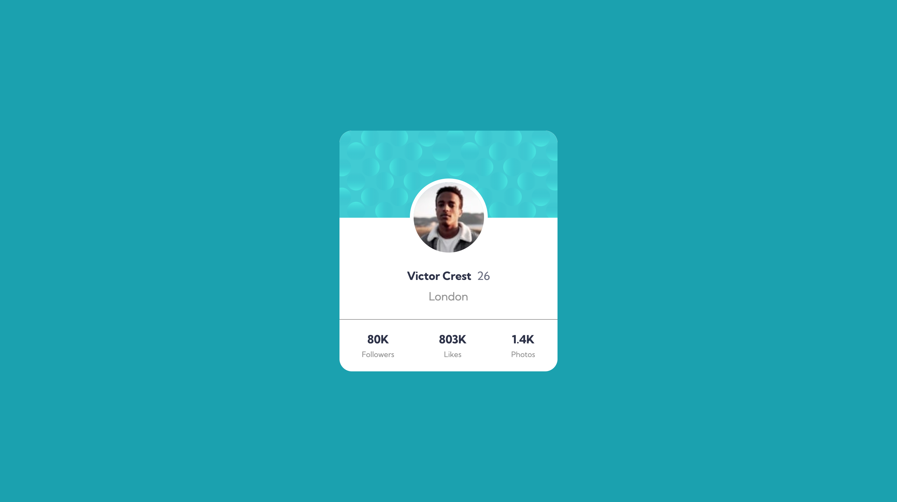

# profile-card-component---fm
Simple Profile Card Component from Frontend Mentor

This is a solution to the [Profile card component challenge on Frontend Mentor](https://www.frontendmentor.io/challenges/profile-card-component-cfArpWshJ).

### Screenshot

### Links
- Solution URL: [Awesome solution URL](https://hombreombre.github.io/profile-card-component---fm/)

### Built with
- Semantic HTML5 markup
- CSS custom properties
- Flexbox

## Author
- Frontend Mentor - [@HombreOmbre](https://www.frontendmentor.io/profile/HombreOmbre)